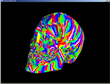

# Tri Stripper

## Prologue

This is a github import of one of my first open source project from 2002-2004. Most of the code has been left unchanged except for compilation errors or now redundant files (e.g. stdint.h). The documentation has been salvaged from a backup copy of its old website.

## Introduction

Drawing 3D models using triangle strips has always been more efficient than just using a bunch of triangles. Tri Stripper automatically generates triangle strips from raw triangles. Meant to be used in runtime, Tri Stripper is fast and efficient. It can take into consideration the presence of the vertex cache found on most 3D cards.

It should also be noted that some of the algorithms and structures used by Tri Stripper can serve other purposes in other domains; for example, computing object silhouette when using "stencil" shadows.

[See full change log.](doc/ChangeLog.md)

## Design

- [How does Tri Stripper work.](doc/How.md)
- [Comparison between Tri Stripper and NVIDIA's NVTriStrip.](doc/VsNvTriStrip.md)
- [How to use Tri Stripper and explanation of the test program.](doc/Manual.md)
