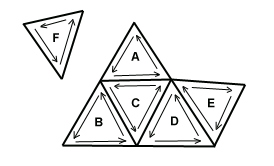
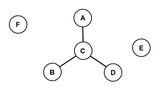
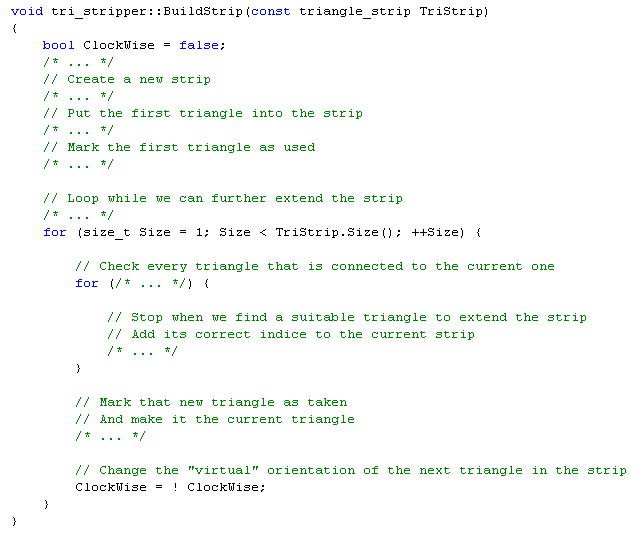

# Tri Stripper: How does it work?

## A few rules to start with

Before explaining how it works, it should be noted that Tri Stripper follows three general rules:

- The triangle stripper is meant to be used in runtime. Speed is the key.
- The triangle stripper should not modify the geometry it was given.
- The triangle stripper just strips. Nothing less, nothing more.

The first point gives the context Tri Stripper is meant to be used in. For example, when the 3D model is loaded by a 3D engine.

The second point is important; it means that Tri Stripper will not alter in any way the 3D model it's working on. This ensures that if the 3D model was properly displayed before, it will still work after being stripped. Example, it will not add degenerated triangles to make its work easier, nor remove them if they're in the original model.

The last and third rules means that Tri Stripper won't do your coffee in the morning, everything that's not directly related to the triangle stripper and that can be done by the application will not be included. Example, it will not remove duplicate vertices from your vertex arrays, nor will it stitch together the resulting strips using degenerated triangles if you want to.

## Creating a strong base: the "Holy" graph

To begin with, Tri Stripper is given a sequence of indices. Using only these indices, the triangle stripper will do its job, so they must be correct! They should only specify triangles, and should be normalized. By "normalized" I mean that there shouldn't be two different indices pointing to the same vertex; otherwise the triangle stripper cannot always know when two triangles share vertices.

The first step, using the indices, is to build a structure that allows the stripper to have a good representation of the triangles. For a given triangle it should be possible to quickly find out what are the other triangles that could possibly make a strip with it. For that purpose a graph will be used.

**Figure 1: a bunch of raw triangles**

Suppose we have a bunch of triangles (see Figure 1). We can see that triangle A shares an edge with C, B with C, C with B and D, D with C and E, E with D, and F with none. We can also see that A, B, C, D and F are in anticlockwise order while E is in clockwise order. All these information will be summarized in the graph we want to build (see Figure 2).

**Figure 2: the graph representing those triangles**

This graph tells us what triangle goes with what triangle. Notice that triangle E is connected to nothing because it's been specified in clockwise order while all other triangles were given in anticlockwise order, this means it cannot be part of a triangle strip with these other triangles. F is obviously alone too.

Building such a graph is fairly easy; we could for example take each triangle one at the time and compare it to every other triangles and see if they correctly share an edge or not. Quickly building such a graph is another story. The previous algorithm would have a complexity of O(n²), we are talking about an algorithm that would take hours to complete if the number of triangles goes near 100,000 and days if there were about 1,000,000 triangles. Obviously another algorithm should be used if the triangle stripper is to be used in runtime.

The idea is to create a search structure that, given an edge, can tell us what triangles it's from. The triangle stripper creates an array of edges, each edge knowing its owner triangle, sorts that array, and then for every edge of every triangle it performs a binary search to find matching edges. All this can be done with a complexity of O(n.log(n)), which is a lot better than the previous O(n²) algorithm. Also note that if that part is done correctly, it will not connect two triangles that share an edge but that aren't specified in the same order (like triangle D and E in Figure 2).

Having that graph built, the stripper has now a strong base for any kind of triangle stripper algorithms.

Note: Tri Stripper uses the graph implementation given by the file "graph_array.h". It's a graph that has a static number of nodes that can dynamicly be linked together; which is perfect in the triangle stripper context.

## Building triangle strips from it

With the famous graph, building a triangle strip is now an easier and faster task.

Tri Stripper assumes that a triangle strip must begin by a triangle specified in anticlockwise order, which is the default behavior of triangle strips in OpenGL (so when using Triangle Stripper, you should send anticlockwise triangles only). Thus if we choose triangle C (see Figure 1 and 2) as the start triangle of a strip, we have 3 possible "2 triangles" strips: CA, CB and CD. If we choose B instead as the starter, we can build BC or BCA strips.

A triangle strip will be thus characterized by 3 elements: its starter triangle, the starter vertex of that triangle, and the number of triangles composing the strip.

To build a strip, given these three elements, the algorithm described by the following pseudo-code can be used (see Figure 3).

**Figure 3: the routine used to build a strip**

This algorithm is pretty straight forward. It takes the first triangle of the strip, using the graph it looks for a suitable triangle to extend the strip, when it finds it the algorithm loops again and repeats the operation untill the size of the strip has been hit.

When taken separatly, the triangles in the created strip had all the same orientation (anticlockwise). But within the strip, if you look at the order of the indices, you'll notice that the orientation changes and you get an alternance of anticlockwise/clockwise triangles. This affects the algorithm used to find the next triangle, which is why I left the boolean variable "ClockWise" in the pseudo-code so you can understand its purpose when looking at the complete implementation of this routine.

## Stripping policy

With the graph and the "strip builder" algorithm described above, the stripper can now build plenty of strips and it can do it quickly (O(n) if done randomly).

However randomly building triangle strips will not help us to get a perfectly optimized 3D model. For sure, it'll be more optimized than the original raw triangles, but there are better ways to do it than randomly.

We can't realistically generate a perfectly optimized 3D model, an algorithm giving us the best solution would take ages to complete. Thus, to keep a relatively fast triangle stripper, we will only build the strips one by one without backtracking. But in order to get better results, a policy is applied when choosing the next strip to be built. The main policy of Tri Stripper is described below.

To get the starter triangle of the next strip, it selects the loneliest triangle. In Figure 1 and 2, that would be either the triangle E or F; but their connectivity degree (loneliness indice) is 0, which means they can't be used to build strips. It will thus select the loneliest triangle that has at least a connectivity degree of 1. This makes the triangles A, B and D good candidates. Lets take A for example.

Then it must select one of the strips that can be generated from that starter triangle. Using A it can only go in one direction and build 2 strips: AC and ACD. It selects the longest strip of all, which is ACD.

Now that it is its next strip, it simply builds it with the algorithm seen previously. But for the "loneliest triangle first" policy to work, the stripper must re-adjust the connectivity degree of the neighbour triangles of the triangles that were used in that strip.

To apply the "loneliest triangle first" policy, and keep track of all the connectivity degrees, Tri Stripper uses the priority queue (the heap) implemented in the file "heap_array.h". This heap has the particularity that its elements can be modified after being inserted, so it allows us to modify the value of the connectivity degrees directly in the heap.

The "loneliest triangle first" policy is used to avoid leaving lonely triangles unstripped. The stripper could have used the "longest strip of all" policy, but the idea is to strip a maximum of triangles and not to make the fewest number of strips. As the following table shows, extending a strip too much is nearly useless as we can't go beyond the theorical limit of 3 for the efficiency factor (Nb indices unstripped / Nb indices stripped); but lonely triangles are a waste.

| Nb of triangles | Nb of indices | Nb of indices (stripped) | Efficiency factor |
| :---: | :---: | :---: | :---: |
|1|3|3|1.0|
|2|6|4|1.5|
|3|9|5|1.8|
|4|12|6|2.0|
|5|15|7|2.1|
|6|18|8|2.2|
|7|21|9|2.3|
|8|24|10|2.4|
|9|27|11|2.4|
|10|30|12|2.5|

Thus a lot of small strips with a few lonely triangles will give a better average efficiency factor than a few big long strips with a lot more lonely triangles.

Another reason why that policy is used is because it tends to choose a starter triangle near the triangles of the previously built strip. This makes the generated triangle strips a little more cache friendly for 3D cards having a vertex cache.

Because a heap is used, this stripping policy leads to a complexity O(n.log(n)).

## Cache aware stripping policy

As seen before, there is a limit to the speed improvement we can get by stripping a 3D model. However we can push that limit further than the theorical factor 3. Using the post T&L vertex cache present on most of the modern 3D cards, such as the GeForce or the Radeon, can offer substencial speed increases.

To make the triangle stripper seen upper cache aware, there isn't much that has to be changed. The stripping policy must be modified a bit and a mechanism that simulates the cache has to be added.

A candidates list is added, it contains the possible starter triangles to be used for the next strip. When that list is empty, the stripper applies the "loneliest triangle first" policy and simply takes the triangle on top of the heap and puts it in that list; otherwise it tries to find out which one of these candidate triangles will lead to the best strip.

The "best" strip is the strip that has the greatest cache hit count. The loneliness of the starter triangle and the size of the strip will still influence the choice of the best strip if two strips have the same cache hit count. It should also be noted that the size of a strip is now limited to the size of the cache, not doing so would decrease the efficiency of the cache.

Now when this "best" strip has been found, the candidate list should be empty. It'll be filled with new candidates when building the selected strip. The new candidates will be the neighbour triangles next to the strip, this ensures that these candidates are cache friendly.

Tri Stripper supports both the normal policy and the cache aware policy (When the cache size is set to 0, the normal policy is used).

With the addition of the cache simulator, the complexity is now O(n.(log(n) + c)) (The cache simulator isn't optimized much because it's meant to simulate relatively small cache. Example: a GeForce 2 has a cache of 16 entries while a GeForce 3 has a cache of 24 entries).

## Conclusion

This gives the general ideas used by Tri Stripper without going into all the details of all the used algorithms. It should make the code of the stripper more readable and understandable.

It also shows that the general complexity of Tri Stripper is O(n.log(n)) where n is the number of triangles. In fact it's more like O(n.(log(n) + c)) where c is the cache size but because the cache size is constant and relatively small compared to the number of triangles the cache complexity can be dropped.
