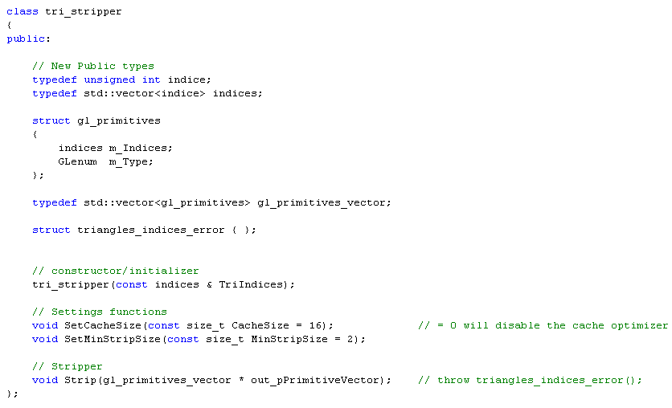

# Tri Stripper: How to correctly use it?

## Introduction

It's important to follow some strict rules when using Tri Stripper, otherwise it might lead to poor results. I'm going to explain how Tri Stripper should be used and how it should not be used. To illustrate this I will also explain how the Tri Stripper test program works.

NOTE: This section was made against Tri Stripper 1.00 BETA 1. Some information given here may not be up-to-date.

## A quick view of the test program "3D engine"

The test program used to test Tri Stripper is in fact a very (very... very...) basic 3D engine. The only thing it actually does is loading 3D models, optimizing them, and then displaying these in a non-interactive way. It considers that a model can be composed of several meshes, and that each mesh can be divided into submeshes. Therefore the used 3D models are stored in a non-standard file format "*.vxo" that follows this idea, and is very similar to OpenGL vertex arrays. The used vxo file format is a binary format; and it's represented as explained below:

- A signature: "OPENGL ENGINE VXO" (null terminated string, this signature is the legacy of an old OpenGL project I worked on.)
- The number of mesh (unsigned int, 4 bytes)
- For each mesh:
  - The name of the mesh (null terminated string)
  - The number of submeshes (unsigned int, 4 bytes)
  - The size of the vertex arrays used for this mesh, in number of vertices (unsigned int, 4 bytes)
  - The number of textures (unsigned int, 4 bytes)
  - The vertex array (3 x 32bits floats for each vertex)
  - The normal array (3 x 32bits floats for each vertex)
  - For each texture:
    - The texture coordinate array (2 x 32bits floats for each vertex)
  - For each submesh:
    - The primitive OpenGL mode (4 bytes, uses OpenGL values such as GL_TRIANGLES or GL_TRIANGLE_STRIP)
    - The number of indices (unsigned int, 4 bytes)
    - The indice array (1 unsigned int (4 bytes) for each indice)

To show some important points on how to use the triangle strippers, at the start the 3D models are completely non-optimized.

Note: to make things easier, the test program always work with 3D models that have one vertex array, one normal array and one texture coordinate array; no more no less.

## What must be done before sending the 3D models to the triangle stripper

Once the 3D models have been loaded, the thirst thing to do is to "normalize" the vertex arrays. By "to normalize the vertex arrays" what I mean is "to remove unreferenced vertices and duplicated vertices".

This is done by the class "varrays_normalizer" in the test program. The nested class "cmp_lt_vertex" is responsible for determining whether two vertices are equivalent or not. In the test program, two vertices are considered to be equivalent if they have the same vertex, normal and texture coordinates.

Normalizing the vertex arrays is crucial for the triangle stripper, because it only works with the indices it can't know when two vertices, referenced by two different indices, are equivalent.

## Initializing and using Tri Stripper

Tri Stripper is defined by the class "tri_stripper". The public interface of this class is shown by Figure 1.

|  |
| :---: |
| **Figure 1: class tri_stripper public interface (1.00 BETA 1)** |

When creating a tri_stripper object, the triangle indices must be given to it. This is done using the two defined types: index and indices. Two important rules must be followed there:

- These indices must refer to triangles. If ((Number_of_indices % 3) != 0) triangles_indices_error() will be thrown when using Strip().
- The specified triangles must be given in the anticlockwise order (It's the positive order in mathematic, it's also the default behavior in OpenGL).

Before running the triangle stripper, some settings can be modified. The CacheSize refers to the effective cache size, setting it to 0 will disable the cache optimizer. The MinStripSize refers to the minimum size that the strips should have (in number of triangles), it shouldn't be set any lower than 2.

Then, to actually run the triangle stripper, Strip() must be called. It takes a pointer to a gl_primitives_vector as a parameter. When the stripper is done, the pointed primitive vector will contain all the triangle strips and/or a triangle list (It's the triangle list containing all the triangles that couldn't be stripped). The type gl_primitives_vector is simply a std::vector of gl_primitives, the type gl_primitives being a vector of indices and a type of primitives (such as GL_TRIANGLES or GL_TRIANGLE_STRIP).

Every primitive that is returned is given in the anticlockwise order.

Depending on what it was able to do with your indices, Tri Stripper will either give back:

- one or more triangle strips (all triangles were stripped)
- one or more triangle strips, and one triangle list (some triangles were stripped but not all)
- one triangle list (no triangle was stripped)
- nothing (you gave it an empty vector of indice)

## What you shouldn't do with the triangle stripper, and what it won't do for you.

You should be careful with the settings you give with SetCacheSize() and SetMinStripSize(); wrong/crazy values will be accepted but will lead to poor results.

CacheSize should be 0 (to disable the cache optimizer), 10 for a GeForce 256 or a GeForce 2, 16 or 18 for a GeForce 3 or a GeForce 4 (play a bit with this setting to find the best value for your 3D card).

MinStripSize shouldn't be any lower than 2, and it shouldn't be set too high either.

Unlike NvTriStrip, Tri Stripper will never stitch the triangle strips into a big one using degenerated triangles. It's not a problem related to the triangle stripper itself (it gives you the triangle strips, what you do with them is not its problem), and it would break one of the most important rules of Tri Stripper (The triangle stripper should not modify the geometry it was given).

Tri Stripper only works with the indices, it won't take care of the normalization of the vertex arrays.

Avoid degenerated triangles in your geometry if you can. Not that they will really affect the triangle stripper, but if they're not useful they might decrease the general efficiency.

## Conclusion

Tri Stripper is meant to be a powerful and flexible triangle stripper for modern APIs such as OpenGL and Direct3D. But it's very easy to misuse it, and so you should be careful when using it.

