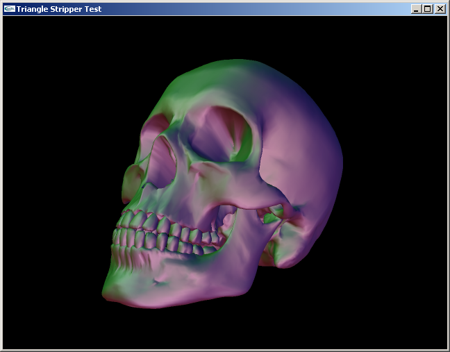
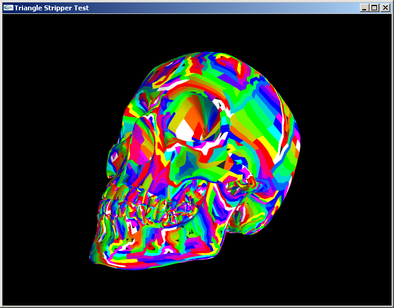
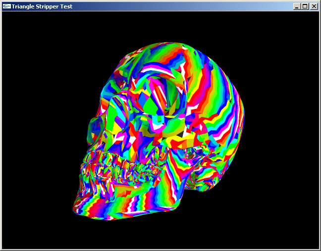

# Tri Stripper vs NvTriStrip

## Introduction

As soon as the first version of Tri Stripper was up and running I had to compare it again something else. [NVIDIA's NvTriStrip](https://www.nvidia.com/object/nvtristrip_library.html) seemed to be the perfect reference for this comparison. Like Tri Stripper, NvTriStrip is designed for modern 3D cards using common APIs such as Direct3D or OpenGL.

The following tests will try to show the advantages and the disadvantages of Tri Stripper compared to NvTriStrip.

## Test setup

The latest versions of Tri Stripper and NvTriStrip available at the moment (26/10/2002) were used (NvTriStrip is dated of 30/01/2002, Tri Stripper version is a pre-Beta 1).

The tests were made on the following platform:

- CPU: Pentium III 700MHz (7x100)
- Motherboard: ABIT BE6
- Memory: 768 MB PC133 (CAS set to 3)
- Video card: Creative GeForce 2 Ultra (default frequency)
- OS: Windows XP Professional
- Video card drivers: NVIDIA Official Detonator XP 30.82

The test program is available in the downloads section. It's the main example program of Tri Stripper.

NvTriStrip, Tri Stripper and the test program were all compiled in Release mode with Visual Studio .NET (7.0).

To stress the T&L part of the 3D card 3 lights were set up, and the rendering was done in a 320*240 window. Two different 3D models were used: a "triangle strips friendly" one and a "triangle strips not so friendly" one.

For each model, at least three tests were applied: one using the original un-stripped model, one using the triangle stripper without any vertex cache enhancements and one using the triangle stripper using vertex cache enhancements. When meaningful, more tests were done.

For both NvTriStrip and Tri Stripper, the minimum strip size was set to 2 triangles.

Each test was run twice during at least 30 seconds to ensure stable results.

All tests were done using the same OpenGL setup. Also for better performances, all tests were done using display lists.

For each test, the compilation time (time taken by the stripper) was given as well as the resulting frame rate and the frame rate improvement over the original model.

## Testing the strippers: the results

#### Skull Test Results (1 mesh; 60,339 triangles)

| | Original Model | No Cache | CacheSize = 22 | CacheSize = 16 | CacheSize = 10 |
| :--- | :---: | :---: | :---: | :---: | :---: |
| **Tri Stripper** | 0 ms / 43.3 fps (100%) | 1240 ms / 100.6 fps (232%) | N/A | 1860 ms / 121.0 fps (279%) | 1710 ms / 123.6 fps (285%) |
| **NvTriStrip** | 0 ms / 43.3 fps (100%) | N/A | 184325 ms / 121.0 fps (279%) | 184855 ms / 130.7 fps (302%) | 259200 ms / 116.5 fps (269%) |

#### Skull Test Strip Details(1 mesh; 60,339 triangles)

| | No Cache | CacheSize = 22 | CacheSize = 16 | CacheSize = 10 |
| :--- | :--- | :--- | :--- | :--- |
| **Tri Stripper** | - number of triangles: 60339 - generated 8647 triangle strips. - stripped 59529 triangles. - left 810 triangles alone. - created 8648 primitive groups. | | - number of triangles: 60339. - generated 8969 triangle strips. - stripped 59125 triangles. - left 1214 triangles alone. - created 8970 primitive groups. | - number of triangles: 60339. - generated 11065 triangle strips. - stripped 58996 triangles. - left 1343 triangles alone. - created 11066 primitive groups. |
| **NvTriStrip** | | - number of triangles: 60339. - generated 5586 triangle strips. - stripped 70284 triangles. - left 958 triangles alone. - created 5587 primitive groups. | - number of triangles: 60339. - generated 7285 triangle strips. - stripped 70945 triangles. - left 958 triangles alone. - created 7286 primitive groups. | - number of triangles: 60339. - generated 14406 triangle strips. - stripped 73466 triangles. - left 958 triangles alone. - created 14407 primitive groups. |

From this first test we can already tell and conclude a a lot of things:

- Obviously, when not using any triangle stripper, the performance of the original model remains the same. The performance achieved with the original model is used as a reference for following results, where 100% refers to the original level of performance (The percentage can be seen as the efficiency of the model).

- NvTriStrip is unable to strip for platforms that don't have a vertex cache. We could give it a large cache size to simulate the wanted behavior but NvTriStrip introduces degenerated triangles that decrease the performance on platforms without a vertex cache. Tri Stripper on the other hand is able to strip for any platform and the performance improvement is significant (an efficiency of at least 200%). The triangle stripper only takes 1.2 seconds to do its job, which meets the requirement for runtime usage. It should be noted that the used test platform has a vertex cache that influences the results; but some other tests made on a software OpenGL renderer shows that the performance is still improved to a level of efficiency over 200%.

- The performance peak (of the model) of each triangle strip is achieved at different cache size. This is because NvTriStrip asks for the absolute cache size and internally translates it into the effective cache size for the GeForce family (this translation is done by decreasing the given cache size by 6). While Tri Stripper takes the given cache size for granted. It can be seen with Tri Stripper that on the used test platform, a GeForce 2, the effective cache size is 10 entries. NvTriStrip works the best with the absolute cache size of the GeForce 2, which is 16 vertex entries. This explains why Tri Stripper gives the best result with CacheSize = 10, and NvTriStrip with CacheSize = 16. As the other tests show, other cache sizes give worse results because the cache is either underused or overloaded. Later on, to compare the performances achieved by the two triangle strippers I will always refer to those two tests, respectively made with CacheSize = 10 for Tri Stripper and CacheSize = 16 for NvTriStrip.

- The difference of efficiency between Tri Stripper and NvTriStrip in the Skull test is small (about 5% of relative difference). But the time taken by NvTriStripper is enormous: Tri Stripper does its job in 1.7 seconds, while it takes no less than 3 minutes with NvTriStrip. This means that the little improvement in efficiency given by NvTriStrip is really expensive in CPU time and that this triangle stripper can't be used in runtime with large 3D models. It should also be noted that NvTriStrip cannot work at all with larger 3D models because it uses 16bits indices (unsigned short) while Tri Stripper works with 32bits indices (unsigned int).

- Because NvTriStrip can't be used in runtime for large 3D models, it can't be tweaked (e.g. setting the cache size) in runtime for the current platform.

- NvTriStrip still gives the most efficient model. When looking into the details, it can be seen that it generates less but longer triangles strips and that it leaves less triangles alone. It seems it has a better global view of the 3D model than Tri Stripper.

- But on the other hand, NvTriStrip adds degenerated triangle strips to make its task easier. When looking at the details of the stripper, you'll see it gives back more stripped triangles than what it was given. Tri Stripper won't do this, as it goes against one of its most important rules: the triangle stripper should not modify the geometry it was given. Most of the time these added degenerated triangles are not a problem, but sometimes they can; it's particularly obvious when viewing the resulting 3D model in wireframe.

|  |
| :---: |
| **Figure 1: The skull test** |

|  |
| :---: |
| **Figure 2: The skull test, strips visualization: NvTriStrip (CacheSize = 22, Effective CacheSize = 16)** |

|  |
| :---: |
| **Figure 3: The skull test, strips visualization: Tri Stripper (CacheSize = 16)** |

To end this comparison, let's make a quick bunch of tests with a "triangle strips unfriendly" 3D model.

#### Starship Test (26 meshes; 27,574 triangles)

| | Original Model | No Cache | CacheSize = 16 | CacheSize = 10 |
| :--- | :---: | :---: | :---: | :---: |
| **Tri Stripper** | 0 ms / 133.5 fps (100%) | 440 ms / 148.5 fps (111%) | N/A | 530 ms / 159.5 fps (120%) |
| **NvTriStrip** | 0 ms / 133.5 fps (100%) | N/A | 16060 ms / 162.1 fps (121%) | N/A |

The results are about the same than with the skull test. But, because this model doesn't strip very well, the difference of efficiency between NvTriStrip and Tri Stripper is even smaller than with the skull test. Also, because this model contains fewer triangles, and because these triangles are split into multiple meshes, the time taken by the two triangle strippers is lower than with the skull test.

## Conclusion

Tri Stripper competes very well against NvTriStrip. Tri Stripper is way (way... wayyyyy....) faster than NvTriStrip; while this comes at the price of a small loss of efficiency, the difference between the two triangle strippers in term of efficiency is really small and almost unoticable.

For offline optimization or/and not so large 3D models, NvTriStrip is the best suited; while Tri Stripper is better suited for runtime usage. Tri Stripper can also work on very large models while NvTriStrip cannot due to a limitation of indices at 16bits.

NvTriStrip modifies the geometry it was given, while Tri Stripper doesn't. This makes Tri Stripper completely transparent. (WYGIWYG - What You Gave Is What You Get ;-))

*UPDATE* (13/11/2002): It appears that Tri Stripper is also a lot more stable than NvTriStrip, this is due to the fact that Tri Stripper can easily handle complex cases, for example it can handle triangles that have more than 3 neighbours (something that NvTriStrip can't do, which causes it to simply crash sometimes).

